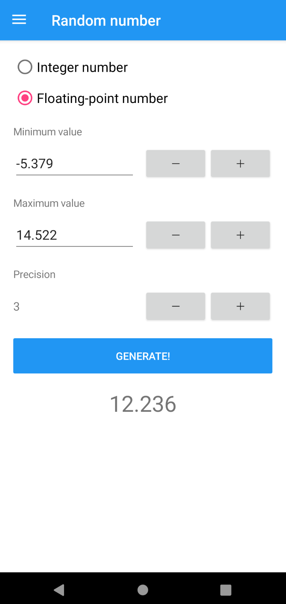
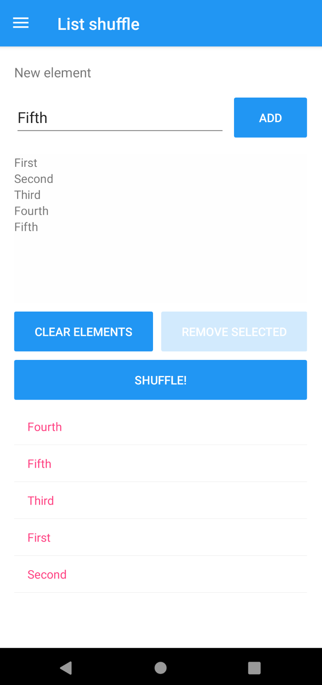

# RandomIt

## Overview

Randomization tool for Android and Windows. Helps generate different kinds of random values, e.g. random numbers, passwords, selecting random list element, shuffling list elements, flipping coins and rolling dice. Created using **Xamarin.Forms** framework.

 

## The future of the project

Currently, the app has proper functionality, yet its style isn't fully developed. In the future, the application will gain eye-friendly and modern-looking user interface.

## Download

View [releases](https://github.com/bkisly/RandomIt/releases) in order to download proper packages for Android and Windows.
